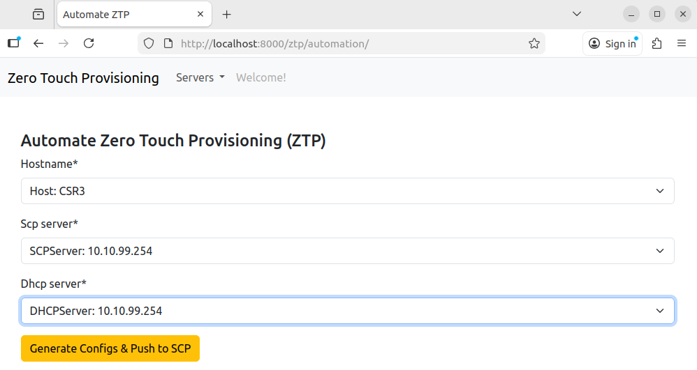

  <!-- Amazon: Kindle + Paperback -->
  
  <!-- Direct Purchase: PDF via Gumroad -->
  
  <!-- Website -->
  
  <!-- GitHub Profile -->
  
  <!-- LinkedIn -->
  

## 📘 *Full Stack Network Automation — The Complete Practical Guide*

This repository is part of the companion resources for the book  
**“Full Stack Network Automation”** — a fully tested, hands-on, real-world guide to Python, Paramiko, REST APIs, Ansible, Docker, GNS3, and Django-based ZTP workflows.

---

### Full Stack Zero Touch Provisioning

This repository is part of Chapter 18 of the Full Stack Network Automation book. We first developed a process to automate the provisioning of new devices in Chapter 10; in this chapter, we will build the front-end for that workflow.

